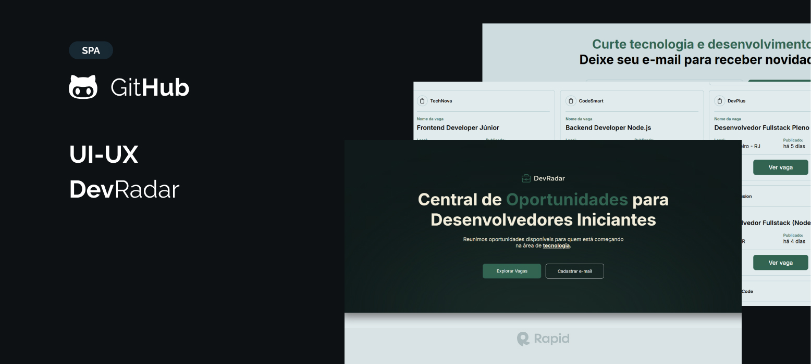

# DevRadar - Vagas de Tecnologia

Um projeto web que exibe e filtra vagas de tecnologia de forma dinâmica, utilizando uma API pública e dados locais. A aplicação permite que usuários visualizem vagas por área (Front-End, Back-End, Full Stack), com visual moderno e responsivo.

---

## Funcionalidades

- ✔️ Consumo de API externa via [RapidAPI](https://rapidapi.com/)
- ✔️ Filtro de vagas por tecnologia com botões interativos
- ✔️ Layout responsivo e animações suaves
- ✔️ Versão offline com arquivo JSON local para testes
- ✔️ Contador dinâmico de vagas encontradas
- ✔️ Estrutura modular com HTML, CSS e JavaScript puros

---

## Tecnologias utilizadas

- HTML5
- CSS3 (com variáveis e transições)
- JavaScript (ES6+)
- RapidAPI (JSearch)
- SVG e animações CSS

---

## Como testar

### ✔️ Usando API:
1. Crie uma conta em [RapidAPI](https://rapidapi.com/)
2. Copie sua chave adquirida na API JSearch e substitua no arquivo `api.js`
3. Inicie com Live Server no `index.html`

### ✔️ Usando modo offline:
1. Certifique-se de que `developer_mode = true` no `main.js`
2. As vagas serão carregadas do `generator.json`

---

## Requisitos

- Navegador moderno (Chrome, Edge, Firefox)
- VS Code (ou editor de sua preferência)
- Live Server para testes locais

---

## Licença

Este projeto está licenciado sob a Licença MIT. Veja o arquivo [LICENSE](./license) para mais detalhes.

## Autor

Feito com 💜 por Shayare 🐈